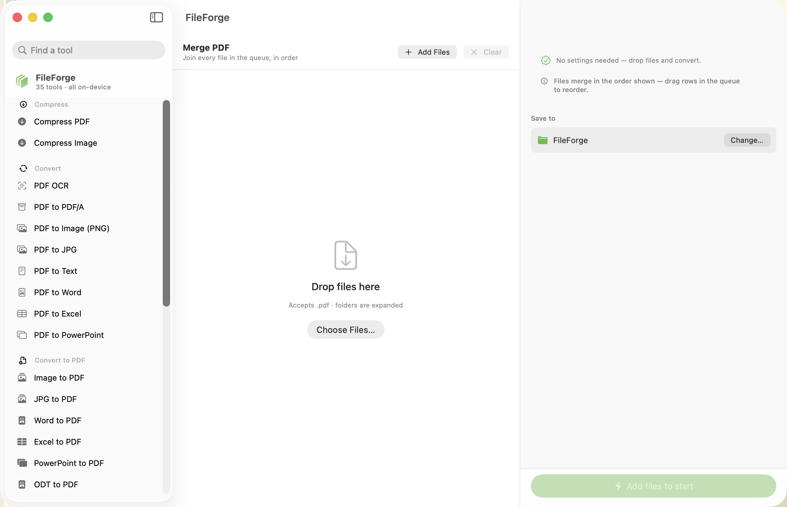

# FileForge

A native macOS file-conversion suite. 35 tools for PDFs, images, Office
documents and text — all running **on your Mac**, with no uploads, no
accounts, no page limits and no watermarks on the output.

The reason this exists: every online PDF tool wants your documents on their
server. Contracts, medical records, bank statements and IDs are exactly the
files people convert most, and exactly the files that shouldn't be uploaded to
a stranger's server for a 20-second job.



## What it does

**Compress** — PDF, images
**Convert from PDF** — OCR (searchable), PDF/A, PNG, JPG, text, Word, Excel, PowerPoint
**Convert to PDF** — images, JPG, Word, Excel, PowerPoint, ODT, ODS, ODP, Pages/Keynote/Numbers, TXT, RTF, HTML, CSV, EPUB
**Organize** — merge, split, rotate, delete pages, extract pages, reverse
**Edit** — number pages, crop, watermark, redact, inspect/unlock

### Details worth knowing

- **OCR** runs on Apple's Vision framework — on-device, 9 languages, and it
  adds an *invisible* text layer so the scan looks identical but becomes
  searchable and copy-pasteable.
- **Redaction is real.** Matched text is deleted, not covered: those pages are
  flattened to images, so the words are gone from the file rather than hidden
  under a black box. (This is the failure mode behind most redaction scandals.)
- **Batch everything.** Drop a folder, drag rows to reorder, and one bad file
  fails on its own row instead of stopping the queue.
- **No silent overwrites.** Outputs get ` 2`, ` 3` suffixes rather than
  clobbering a file you already have.
- **Compression never makes things worse.** If re-encoding would produce a
  larger file, the original is kept and the app says so.

## Requirements

- macOS 15 (Sequoia) or later
- **LibreOffice** — only for the Office formats (`.docx`/`.xlsx`/`.pptx`/ODF/EPUB)
  and PDF → Word/Excel. macOS has no API to read those, so they're delegated to
  LibreOffice, which the app detects at runtime. The affected tools are flagged
  with a ⚠️ in the sidebar until it's installed.

  ```bash
  brew install --cask libreoffice
  ```

  Everything else — all PDF work, images, OCR, text, HTML, CSV, RTF and iWork —
  needs nothing beyond macOS.

## Build

```bash
brew install xcodegen        # once
xcodegen generate
xcodebuild -project FileForge.xcodeproj -scheme FileForge -configuration Debug build
open ~/Library/Developer/Xcode/DerivedData/FileForge-*/Build/Products/Debug/FileForge.app
```

Or just open `FileForge.xcodeproj` in Xcode and hit Run.

## How it's built

| Layer | What it does |
|---|---|
| `Engine/Operation.swift` | The catalog — one enum case per tool, plus what it accepts and which options it shows. The UI is written once against this, so adding a tool is a case and a switch arm. |
| `Engine/PDFEngine.swift` | PDFKit work: merge, split, rotate, page surgery, numbering, crop, watermark, redaction. |
| `Engine/ImageEngine.swift` | Rasterizing, Vision OCR, image/PDF compression, PDF/A export. |
| `Engine/DocumentEngine.swift` | TextKit pagination, WebKit HTML rendering, CSV parsing, iWork previews, LibreOffice bridging. |
| `Engine/JobRunner.swift` | The queue: per-file status, progress, cancellation, and keeping one failure from killing a batch. |
| `UI/` | SwiftUI three-pane window: tools, queue, options. |

Conversions run off the main thread, so the window stays responsive while a
hundred pages render.

## Known limits

- **PDF → Word** reconstructs structure rather than recovering it — PDF has no
  notion of paragraphs. Text-based PDFs come out well; complex layouts need
  tidying. (Scans are OCR'd automatically first, so there's text to convert.)
- **PDF → Excel** infers columns from how text is aligned on the page, then
  builds a real `.xlsx`. LibreOffice can't open a PDF as a spreadsheet at all,
  so this is rebuilt rather than imported: tabular PDFs convert well, prose
  becomes a single column.
- **PDF → PowerPoint** makes one full-bleed slide per page. Impress can't
  import PDFs either, so FileForge writes the `.pptx` directly — you get an
  editable deck, not text boxes guessed from a layout.
- **PDF/A** is an archival-style export (self-contained, metadata stamped), not
  a certified PDF/A-1b conversion — full compliance needs embedded ICC output
  intents and font subsets, which requires Ghostscript.
- **Compress PDF** rasterizes pages, so text stops being selectable. It's aimed
  at scans and photo-heavy PDFs, where it typically cuts 50–90%.

## License

MIT

---

Built by Ibrahim Sultan.
